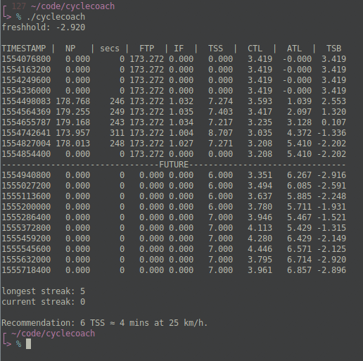
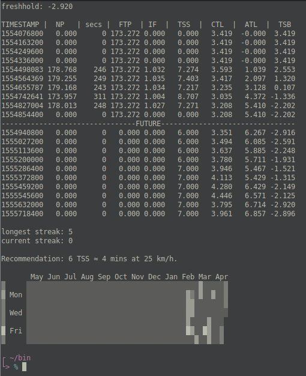

# Cyclecoach

Reads your workout history and data from tss.log generated by [silvercheetah][1] and calculates the TSS that is needed day-by-day to achieve optimal fitness while remaining under a given freshness threshold.

Also, uses a formula which correlates TSS with time, speed, and FTP during a workout. With this, it can recommend how long you need to cycle at some speed to achieve today's recommended TSS.

I like to pair this with my other code [gitgraph][2] to get this:

[1]: https://github.com/korganrivera/silvercheetah
[2]: https://github.com/korganrivera/gitgraph
